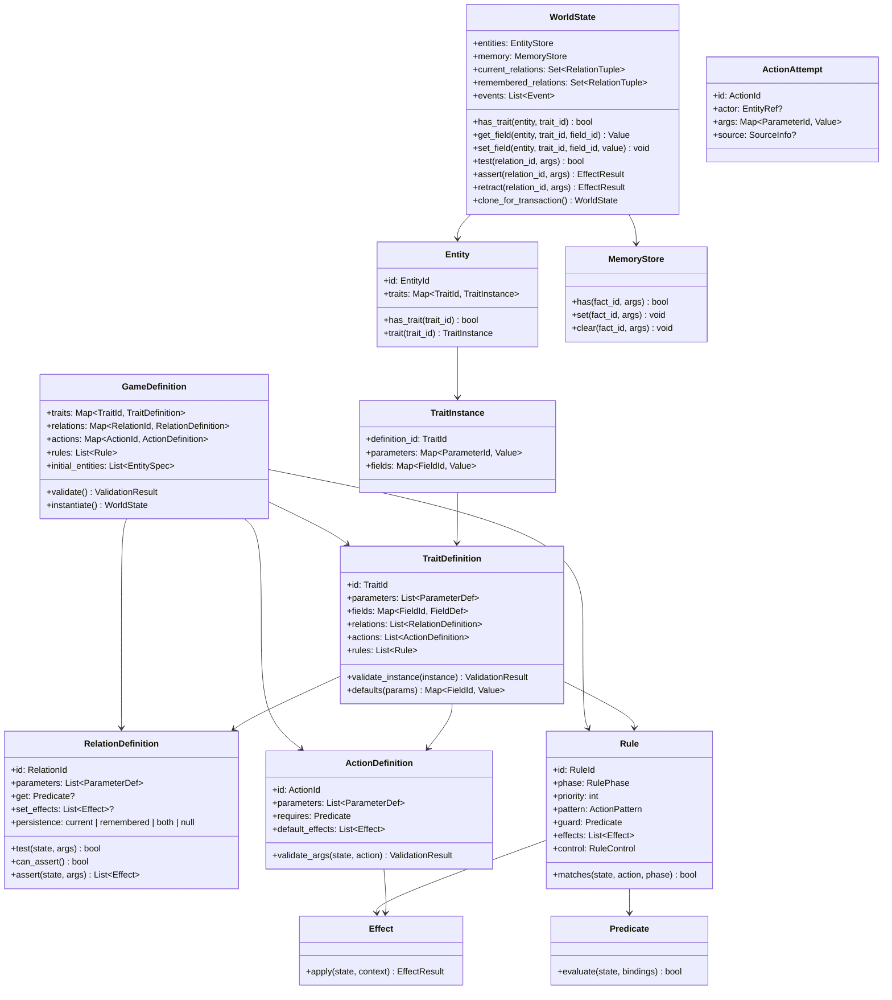
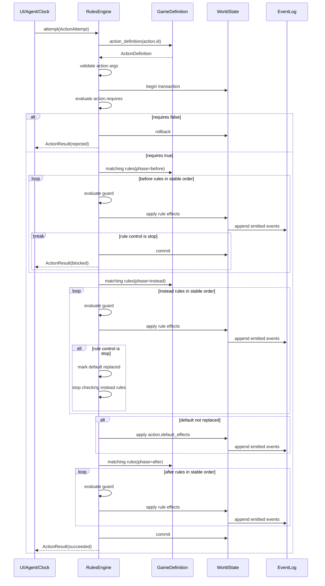

# Rules Engine Runtime Spec

This document describes the runtime model that should be shared by every Qualms rules engine implementation. It is not a game schema and it is not a UI model. It defines the semantics that a YAML definition compiles into.

## Goals

- Define a small genre-agnostic engine.
- Make action resolution deterministic across implementations.
- Keep authored state access behind relations instead of exposing trait fields as the public rules surface.
- Allow nova-like Qualms content to be expressed by a prelude plus story data, not by hard-coded engine classes.
- Leave interface rendering, persistence format, editor UX, AI co-authoring, and performance optimizations outside the core semantics.

## Core Concepts

`Entity` is the only intrinsic world object. Its only intrinsic authored field is `id`. Every other capability or piece of data comes from traits.

`TraitDefinition` describes a named capability. It may define fields, relation definitions, action definitions, rules, and constraints. A trait instance is the data for one trait attached to one entity.

`RelationDefinition` is the public query interface over world state. A relation is derived when it has a tester, writable when it defines an assertion body, and stored when it declares persistence. Effects can assert writable or stored relations without running another action pipeline.

`ActionDefinition` describes a semantic transition request. Actions are what rules observe, block, replace, and extend.

`Effect` is a primitive result instruction applied while resolving an action or rule. Effects mutate state, create/destroy entities, assert or retract stored relations, assert writable relations, set/clear legacy memory facts, or emit output events. Effects do not recursively trigger action rules.

`Rule` is a pattern plus phase plus guard plus effects. Rules match actions, not UI commands.

`WorldState` stores entities, trait field values, stored relation tuples, legacy memory facts, and emitted events. It does not need to remember authoring constructs such as kinds or rulebooks unless an implementation wants provenance for an editor.

`KindDefinition` and `RuleBookDefinition` are compile-time authoring constructs. They may be retained as metadata, but they are not required for runtime action resolution.

## UML-Style Runtime Model



## Primitive Types

```text
EntityId     := non-empty stable string unique within one world
TraitId      := non-empty string unique within one game definition
RelationId   := non-empty string unique within one game definition
ActionId     := non-empty string unique within one game definition
RuleId       := non-empty string unique within one game definition after compilation
FieldId      := non-empty string unique within one trait definition
ParameterId  := non-empty string unique within one definition
Value        := null | bool | int | float | string | EntityRef | list<Value> | map<string, Value>
EntityRef    := EntityId
```

All ids are case-sensitive. Schema authors should prefer lower-kebab-case for authored ids and UpperCamelCase for trait/action/relation names, but casing style is not semantic.

## Entity

An entity has:

```text
Entity
  id: EntityId
  traits: TraitId -> TraitInstance
```

`id` is identity. Name, description, position, location, inventory, agency, and rendering data are traits.

Required behavior:

- `has_trait(entity, trait_id)` returns true iff the entity currently has that trait.
- Adding a trait initializes omitted fields from the trait definition defaults.
- Removing a trait removes its private field values and makes actions/relations requiring it no longer match.
- Implementations may cache indexes, but caches must be observationally equivalent to the entity trait map.

## Trait Definition

A trait definition has:

```text
TraitDefinition
  id
  parameters
  fields
  relations
  actions
  rules
  constraints
```

Trait fields are private to the trait and to relation/action/effect definitions that explicitly reference that trait. Authored rules should prefer relations over raw field access.

Parameterized traits are template expansions. For example, `Traversable<TravelAction, Origin, Destination>` is compiled into a concrete trait instance with bound parameters. Runtime implementations may retain parameters, but behavior must match expansion into explicit definitions.

## Relation Definition

Relations are public predicates over world state. A relation can be derived from fields, writable through a setter, stored directly, or both derived and writable through explicit effects:

```text
relation At(r: Relocatable, l: Location)
  get := r.Relocatable.location == l
  set := r.Relocatable.location = l
```

Required behavior:

- `test(state, args)` is pure and deterministic.
- `assert(state, args)` is allowed when the relation defines a setter or declares persistence.
- Asserting a writable relation applies the setter's effects directly.
- Asserting a stored relation writes the relation tuple into its configured store.
- `persistence: current` stores present-tense state; `remembered` stores past/long-lived state; `both` writes and tests against both.
- `retract(state, args)` is allowed only for stored relations and removes the tuple from the configured store.
- Asserting a relation does not create an `ActionAttempt` and does not run action rules.
- A pure derived relation, such as `Nearby(a, b)`, has no setter or persistence and cannot be asserted.

Writable relations are the preferred mutation surface for rules and action defaults. This lets story authors say `assert At(enemy, spawn_point)` without exposing `Relocatable.location` as the public schema.

Stored relations are the preferred way to model remembered facts. For example, `Visited(actor, location)` can be `persistence: remembered` and asserted by an `after Enter` rule.

## Action Definition

Actions represent semantic attempts:

```text
action Move(actor: Actor?, subject: Relocatable, destination: Location)
  requires := CanAct(actor) and Reachable(subject, destination)
  default:
    assert At(subject, destination)
```

Required behavior:

- Action arguments are validated before rules run.
- The action `requires` predicate is the default precondition for attempting the action.
- Rules may further block, replace, or extend successful attempts.
- The default behavior is a list of effects.
- Default behavior must be expressible in portable declarative effects.

The `actor` parameter is conventional but not intrinsic. Some actions may have no actor, such as world maintenance or timed events. Interfaces decide which attempted actions to offer to a player or agent.

## Rule

Rules match action attempts:

```text
rule block_vacuum_walk
  phase: before
  match: Enter(actor: ?a, destination: lunar-surface)
  unless: Equipped(?a, spare-expedition-suit)
  effects:
    - emit "As unbearable as life is here, you still prefer it to vacuum."
  control: stop
```

Rule fields:

```text
id: RuleId
phase: before | instead | after
priority: int = 0
pattern: ActionPattern
guard: Predicate = true
effects: List<Effect>
control: continue | stop = continue
```

Required behavior:

- A rule matches when phase, action id, bound constants, and guard all match.
- Rules are evaluated by ascending `priority`, then by compiled document order.
- `before` rules run before default behavior. `stop` blocks the action after applying that rule's effects.
- `instead` rules run after successful `before` rules. The first matching `instead` rule with `stop` replaces the default behavior after applying its effects.
- `instead` rules with `continue` apply effects and allow later instead rules or the default behavior.
- `after` rules run only if the action was not blocked and either default behavior or an instead replacement completed.
- Rule effects apply in listed order.

This ordering is intentionally simple. A later spec can add named rule phases only if the simple pipeline becomes insufficient.

## Effect Algebra

Effects are primitive state/output instructions. Minimum required effects:

```text
assert relation(args...)
retract relation(args...)
set_fact fact(args...)
clear_fact fact(args...)
emit event
create entity
destroy entity
grant_trait entity trait
revoke_trait entity trait
set_field entity.trait.field value
```

Preferred authored effects should use `assert relation(...)` and `retract relation(...)` instead of `set_field` or untyped facts. `set_field` exists for trait/action/relation definitions and low-level engine preludes; story content should rarely need it.

Required behavior:

- Effects apply directly to the current action transaction.
- Effects do not run the action pipeline.
- Effects are deterministic.
- If any effect fails, the whole action attempt fails and rolls back unless the implementation explicitly documents non-transactional execution for an editor preview mode.
- `emit` appends an event to `WorldState.events`; rendering that event is interface-specific.

`create entity` instantiates traits and field defaults from an entity spec or kind expansion. If the created entity must be placed, the action or rule must also assert a relation such as `At(new_enemy, spawn_point)`.

## Predicate Algebra

Minimum required predicates:

```text
true
false
not P
all [P...]
any [P...]
relation relation(args...)
fact fact(args...)
has_trait entity trait
equals left right
compare left op right
contains collection item
```

Predicates are pure. They may query world state, relation tests, memory facts, action arguments, constants, and local rule bindings.

Open TODO: once the prompt UI and coauthoring tools have more real usage, define a small query layer over entities, traits, and relations. The current object structure is enough for direct engine evaluation, but UI/tool projections will likely need supported queries rather than ad hoc scans.

## Action Resolution Sequence



Equivalent ASCII summary:

```text
attempt action
  validate action id and args
  begin transaction
  if not action.requires: rollback, reject
  for matching before rules:
    apply effects
    if stop: commit, blocked
  for matching instead rules:
    apply effects
    if stop: default_replaced = true; break
  if not default_replaced:
    apply action default effects
  for matching after rules:
    apply effects
  commit, succeeded
```

## Authoring Constructs That Compile Away

`KindDefinition` bundles traits, defaults, and contributed rules:

```text
kind Ship
  traits: [Presentable, Location, Container, Relocatable, Boardable, Vehicle]
```

At runtime, an entity created as `kind: Ship` is just an entity with expanded traits and initialized fields. Keeping `kind: Ship` as metadata is allowed but not required for behavior.

`RuleBookDefinition` bundles rules behind a shared guard:

```text
rulebook SystemLocalRules(this: System)
  when: At(player, this)
  rules:
    ...
```

This compiles as if the rulebook guard were conjoined into every contained rule. A runtime may optimize by testing the shared guard once, but that optimization must not change results.

## Determinism Requirements

To make implementations agree:

- All rule ordering is stable: priority first, compiled document order second.
- All map-like authoring structures that affect behavior must compile to explicit ordered lists.
- Predicates and effects must not depend on wall-clock time, random numbers, hash iteration order, locale sorting, or UI state unless those values are explicit action arguments or state fields.
- Randomness must be supplied as explicit state, such as a seeded random stream trait or an action argument.
- Floating point comparisons should be avoided in core rules where exact agreement matters. If geometry is needed, a prelude must define rounding and comparison behavior.

## Interface Boundary

The engine returns action results and emitted events. Interfaces decide:

- which available actions to show,
- how to label actions,
- how to render emitted events,
- how to collect action arguments,
- how to map keyboard, mouse, controller, or agent choices into action attempts.

The curses implementation can remain menu-driven while still driving the same `attempt(action)` API.
