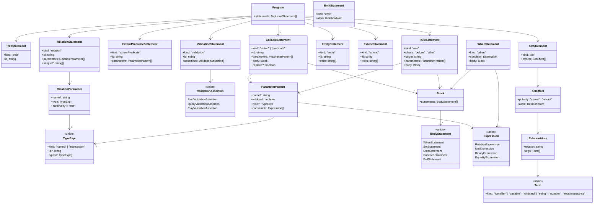
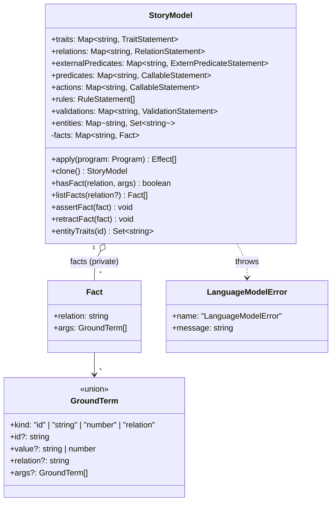
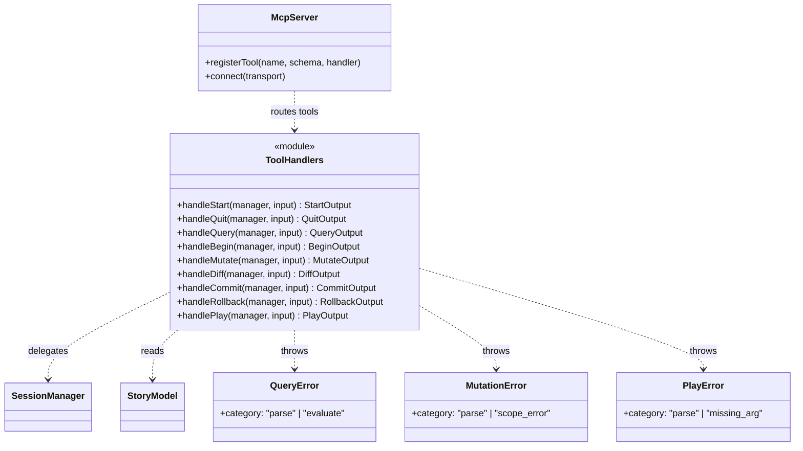
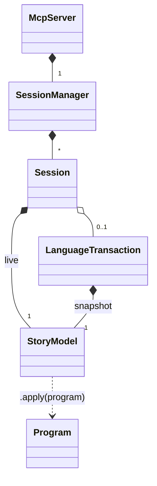

# Engine Model — Class Diagrams

This document gives a UML-style structural view of the implicit runtime
objects that the engine creates while loading, querying, mutating, and
playing a Qualms story. It reflects the implementation in
`qualms/src/language/` and `mcp/src/` at the time of writing — no
forward-looking surface is included.

Diagrams are written in Mermaid (`classDiagram`).

---

## 1. Authored Surface (AST)

The parser produces a tree of immutable AST nodes. Every node is
`readonly`-tagged in the TypeScript definitions; nothing mutates an AST
after parsing.



Notes:

- `Term` of kind `relationInstance` carries a nested `RelationAtom`,
  enabling relation-valued arguments such as `Gated(Path(?here, target),
  ?door)`.
- `ParameterPattern` constraints are arbitrary `Expression` trees; they
  share grammar with `when` conditions (see `language.md` § 5.5).

---

## 2. Story Model (Runtime State)

`StoryModel` is the central runtime object. It indexes declarations and
holds the fact base.



Invariants:

- `traits`, `relations`, `predicates`, `actions` keys are unique. The
  `replace` modifier on a `CallableStatement` overwrites the existing
  entry in place; non-`replace` redeclaration raises
  `LanguageModelError`.
- `rules` is order-preserving and never deduplicated — order is the
  authoring order, and rule evaluation follows that order
  (`runtime.ts:runRules`).
- `entities` keys are unique. `extend` mutates the trait set in place
  (additive only).
- `facts` is keyed by `factKey(fact)` (`relation|JSON(args)`).
- `validations` keys are unique and declaration-order preserving. They do
  not execute during load; they run through `runLanguageValidations`.
- `clone()` produces a deep-enough copy for transaction snapshots: a
  fresh `StoryModel` with new `Map`/`Set` containers, sharing AST nodes
  by reference. This is provisional — see
  `memory/project_transaction_model.md` for the migration plan to an
  amend layer.

---

## 3. Runtime Helpers

The runtime is functional — it does not introduce long-lived objects
beyond an in-flight `Env`. The notable types are listed here for
reference because they appear in protocol traces (`protocol.md`).

```mermaid
classDiagram
  class Env {
    <<type alias>>
    Record~string, GroundTerm~
  }

  class LanguagePlayResult {
    +status: "passed" | "failed"
    +feedback: string
    +reasons: string[]
    +effects: Effect[]
    +events: LanguageEvent[]
    +failures: LanguageFailure[]
  }

  class LanguageEvent {
    +event: string
    +args: GroundTerm[]
  }

  class LanguageFailure {
    +kind: "unknown_action" | "action_failed" | "condition" | "terminal"
    +message: string
    +callable?: string
  }

  class LanguageValidationResult {
    +status: "passed" | "failed"
    +failures: LanguageValidationFailure[]
  }

  class LanguageValidationFailure {
    +validation: string
    +assertion: number
    +message: string
  }

  class BlockResult {
    <<internal>>
    +status: "passed" | "failed" | "no_match"
    +env: Env
    +reasons: string[]
    +terminal?: "succeed" | "fail"
  }

  class LanguageParseError {
    +name: "LanguageParseError"
    +span?: { offset, line, column }
  }

  LanguagePlayResult ..> Env : produced from terminal Env
  BlockResult --> "1" Env
```

`BlockResult` is the internal contract returned by every body-statement
and rule evaluator. It is not exported. `LanguagePlayResult` is the
external shape returned by `playLanguageCall`. Action execution is staged on
a cloned `StoryModel`; the returned `effects` are committed to the live model
only after the action body and all applicable `after` rules pass.

`LanguageValidationResult` is the external shape returned by
`runLanguageValidations`. Validation play assertions use a cloned model and
discard their effects.

---

## 4. MCP Session Layer

The MCP package owns sessions, transactions, and the tool entry points.
A `SessionManager` is the single root managing concurrent sessions for a
running server.

```mermaid
classDiagram
  class SessionManager {
    -sessions: Map~string, Session~
    +start(options) Session
    +get(sessionId) Session
    +has(sessionId) boolean
    +quit(sessionId) boolean
    +size() number
    +beginTransaction(sessionId, targetPath?) LanguageTransaction
    +requireTransaction(sessionId, transactionId) { session, transaction }
    +applyToTransaction(sessionId, transactionId, source) void
    +rollback(sessionId, transactionId) { discarded }
    +commit(sessionId, transactionId) { committed, transaction }
  }

  class Session {
    +id: string
    +model: StoryModel
    +storyPaths: readonly string[]
    +transaction: LanguageTransaction | null
  }

  class LanguageTransaction {
    +id: string
    +snapshot: StoryModel
    +applied: string[]
    +targetPath?: string
  }

  class SessionNotFoundError
  class TransactionNotFoundError
  class TransactionAlreadyOpenError

  SessionManager "1" o-- "*" Session
  Session "1" *-- "1" StoryModel : live model
  Session "1" o-- "0..1" LanguageTransaction : open tx
  LanguageTransaction "1" *-- "1" StoryModel : snapshot

  SessionManager ..> SessionNotFoundError : throws
  SessionManager ..> TransactionNotFoundError : throws
  SessionManager ..> TransactionAlreadyOpenError : throws
```

Lifecycle invariants:

- A `Session` owns exactly one live `StoryModel`. Queries always operate
  on this live model, even mid-transaction. Mutations applied to a
  transaction modify the live model directly; rollback restores from the
  snapshot.
- A `Session` has at most one open `LanguageTransaction` at a time. Calls
  to `beginTransaction` against a session with an open transaction throw
  `TransactionAlreadyOpenError`.
- `applied` is an append-only list of the raw DSL source fragments fed
  into the transaction. `diff` returns this list verbatim.
- `targetPath` defaults to the session's single loaded story path if
  exactly one was provided; otherwise it must be passed explicitly to
  `beginTransaction`. Without a `targetPath`, `commit` finalises the
  transaction in memory but does not persist.

---

## 5. MCP Tool Layer

The tool handlers are thin functions over `SessionManager`. They are
shown here as a service surface to ground the sequence diagrams in
`protocol.md`.



Tool surface (`server.ts:buildServer`): `start`, `quit`, `query`,
`begin`, `mutate`, `diff`, `commit`, `rollback`, `play`. Each tool's
input and output shapes are codified by Zod schemas in `server.ts` and
TypeScript interfaces in `tools.ts`.

Error mapping in `server.ts:errorResult`:

- `QueryError | MutationError | PlayError` → `"[<category>] <message>"`
  with `isError: true`.
- `SessionNotFoundError | TransactionNotFoundError |
  TransactionAlreadyOpenError` → message only, `isError: true`.
- Any other `Error` → message only, `isError: true`.

---

## 6. Object Ownership Summary



In words:

- The `McpServer` owns one `SessionManager` for its lifetime.
- The `SessionManager` owns all `Session` instances.
- Each `Session` owns its live `StoryModel`.
- An open `LanguageTransaction` owns a cloned `StoryModel` snapshot.
- A `Program` is transient: parsed, applied to a `StoryModel`, then
  discarded. The runtime keeps only the AST nodes it needs through the
  declaration maps and `rules` list inside the model.
