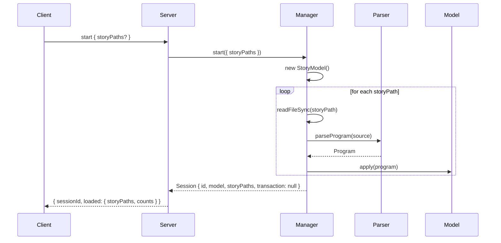
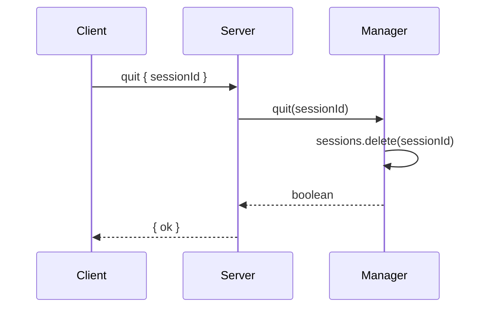
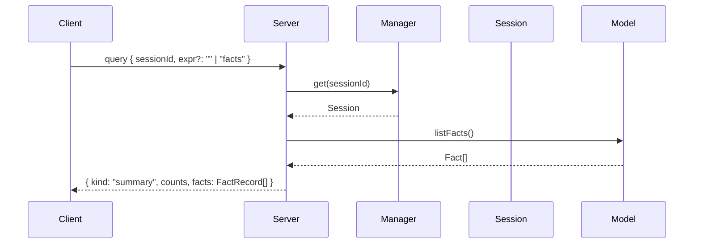
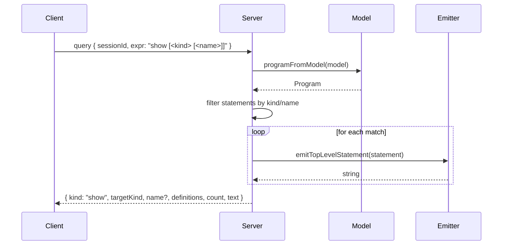
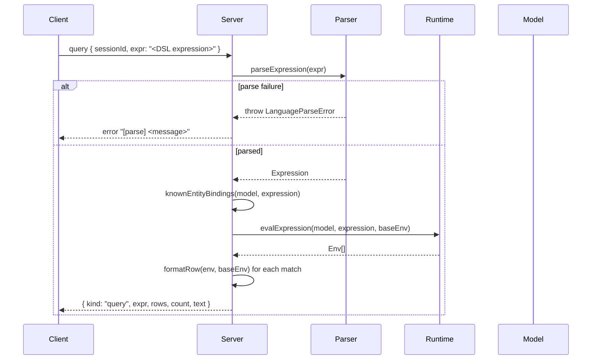
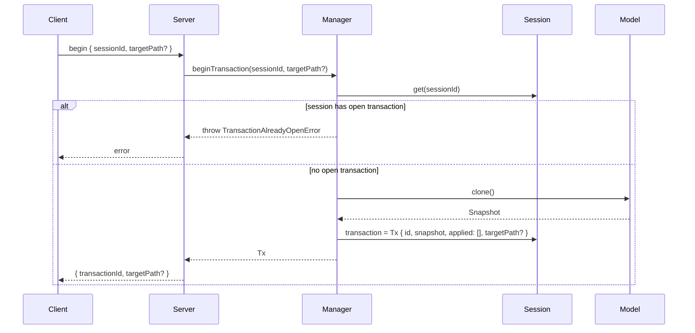
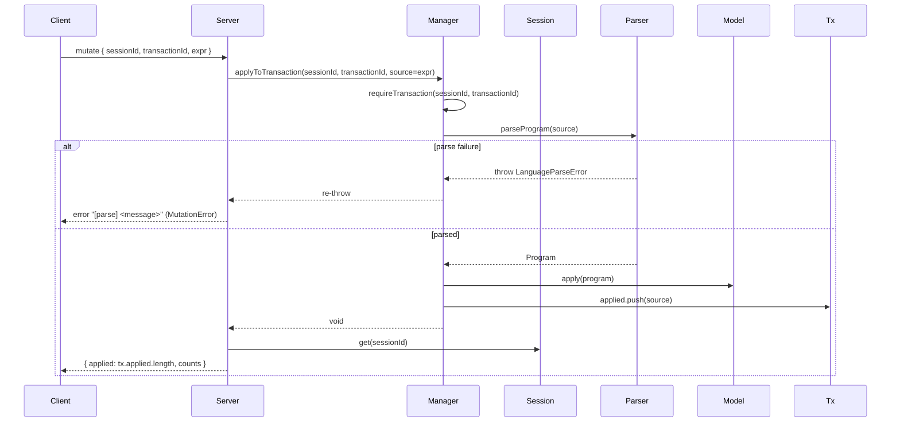
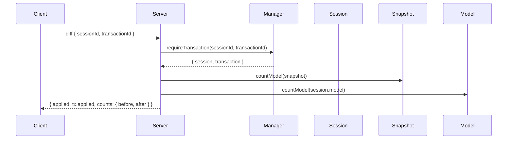
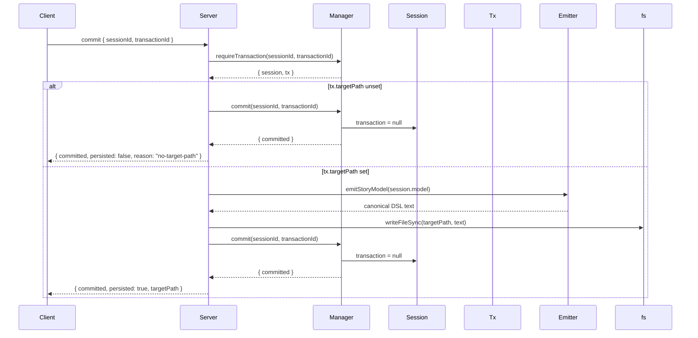

# Query and Update Protocol — Sequence Diagrams

This document specifies the protocol surface that MCP clients use to load,
inspect, mutate, and play a Qualms story. Each diagram corresponds to a
single tool registered by `mcp/src/server.ts:buildServer`. The diagrams
reflect implemented behavior in `mcp/src/{server,session,tools}.ts` and
`qualms/src/language/`.

Participant abbreviations used throughout:

- **Client** — any MCP client invoking the registered tools.
- **Server** — `McpServer` from `@modelcontextprotocol/sdk`, dispatching
  to tool handlers in `tools.ts`.
- **Manager** — the `SessionManager` (`mcp/src/session.ts`).
- **Session** — a `Session` record owned by `Manager`.
- **Tx** — an open `LanguageTransaction` (`Session.transaction`).
- **Model** — the live `StoryModel` on the session.
- **Snapshot** — a cloned `StoryModel` stored on `Tx`.
- **Parser / Runtime / Emitter** — modules in
  `qualms/src/language/{parser,runtime,emitter}.ts`.

---

## 1. Session Lifecycle

### 1.1 `start`



Errors:

- `LanguageParseError` from `parseProgram` propagates as a generic error
  (`isError: true`, message only).
- `LanguageModelError` from `Model.apply` propagates likewise.
- File I/O errors (e.g. missing file) propagate as the underlying node
  error.

### 1.2 `quit`



`quit` is idempotent: deleting an unknown session id returns `ok: false`
without raising. The handler does not require that any open transaction
be closed first; the session and its transaction are both discarded.

---

## 2. Inspection

### 2.1 `query` — summary mode

When `expr` is omitted or equal to the literal string `"facts"`, the
handler returns a model summary.



`counts` covers `traits`, `relations`, `predicates`, `actions`, `rules`,
`entities`, `facts`. Each `FactRecord` carries structured `args` plus a
ready-to-print `text` form.

### 2.2 `query` — show mode

The handler matches `^show( <kind>)?( <name>)?;?$` to route to definition
extraction.



`targetKind` recognises any AST kind that the emitter produces:
`trait`, `relation`, `predicate`, `action`, `rule`, `entity`, `set`. The
sentinel value `"all"` is returned when `<kind>` is omitted.

### 2.3 `query` — expression mode

Any other non-empty `expr` is parsed as a DSL expression and evaluated
against the live model.



`knownEntityBindings` pre-binds any identifier referenced in the
expression that also names a declared entity. This lets callers write
`At(Player, Cell)` directly without explicit binding; identifiers that do
not name an entity remain free and may be bound by the match. `formatRow`
elides bindings that match the pre-bound base env so the result rows
contain only the *new* bindings discovered by the query.

Evaluation errors during `evalExpression` propagate as
`QueryError(category: "evaluate")`.

---

## 3. Transactions

### 3.1 `begin`



`targetPath` resolution: if the caller passes one, it is used verbatim.
Otherwise the manager infers it from the session's `storyPaths` *only* if
exactly one path was loaded.

### 3.2 `mutate`



Notes:

- `mutate` accepts any top-level program fragment. This includes new
  declarations *and* `set` statements; arbitrary expression evaluation is
  not in scope (use `query` for that).
- Mutations modify the live model in place. They become visible to
  subsequent `query` calls in the same session immediately.
- A `LanguageModelError` from `model.apply` (duplicate declaration,
  unknown trait, etc.) propagates without category and surfaces as a
  generic tool error.

### 3.3 `diff`



`applied` is the verbatim list of source strings fed into `mutate`.
There is no per-statement diff — the protocol surfaces text, not
structural deltas.

### 3.4 `commit`



After `commit`, the session retains the live model in its current state
(with any mutations applied during the transaction). The snapshot held
by `Tx` is discarded with the transaction.

### 3.5 `rollback`

```mermaid
sequenceDiagram
  participant Client
  participant Server
  participant Manager
  participant Session
  participant Tx
  participant Snapshot

  Client->>Server: rollback { sessionId, transactionId }
  Server->>Manager: rollback(sessionId, transactionId)
  Manager->>Manager: requireTransaction(...)
  Manager->>Snapshot: clone()
  Snapshot-->>Manager: fresh Model
  Manager->>Session: model = fresh; transaction = null
  Manager-->>Server: { discarded: tx.applied.length }
  Server-->>Client: { discarded }
```

The rollback clones the snapshot a second time so the snapshot itself
remains untouched in case future code needs it (the transaction is
otherwise discarded immediately, so this is mainly defensive). The
session's live model is replaced wholesale.

---

## 4. Play

```mermaid
sequenceDiagram
  participant Client
  participant Server
  participant Manager
  participant Runtime
  participant Model

  Client->>Server: play { sessionId, call }
  alt call missing/empty
    Server-->>Client: error "[missing_arg] play requires `call` …" (PlayError)
  else
    Server->>Manager: get(sessionId)
    Manager-->>Server: Session
    Server->>Runtime: playLanguageCall(model, call)
    activate Runtime
    Runtime->>Runtime: parseRelationAtom(call)
    alt parse failure
      Runtime-->>Server: throw LanguageParseError
      Server-->>Client: error "[parse] <message>" (PlayError)
    else parsed
      Runtime->>Model: actions.get(atom.relation)
      alt action unknown
        Runtime-->>Server: { status: "failed", feedback: "fail { !Foo(...); }", reasons: ["!Foo(...)"] }
      else action found
        Runtime->>Runtime: executeCallable(action, args, "action", {})
        Note over Runtime: bind parameters, run before rules,<br/>execute body, run after rules
        Runtime-->>Server: LanguagePlayResult
      end
    end
    deactivate Runtime
    Server-->>Client: { call, status, feedback, reasons }
  end
```

`play` operates on the live model. If a transaction is open, the play
sees its in-progress effects; `set` effects executed inside the action
body persist into the live model and survive a subsequent `rollback`
only if `rollback` is called *outside* the play — i.e. play mutations
made within an open transaction can be reverted by rolling that
transaction back.

### 4.1 Callable evaluation detail

The internal flow of `executeCallable` (shared by actions and predicates):

```mermaid
sequenceDiagram
  participant Runtime
  participant Model

  Runtime->>Runtime: bindParameters(patterns, args, baseEnv)
  Note right of Runtime: produces Env[] of candidate bindings;<br/>each env carries names + ambient bindings
  alt no candidate
    Runtime-->>Runtime: failed, reasons=[!Callable(args…)]
  else
    loop for each candidate env
      Runtime->>Runtime: runRules("before", id, args, baseEnv)
      alt before terminal succeed/fail
        Runtime-->>Runtime: short-circuit with terminal
      else
        Runtime->>Runtime: executeBlock(body, env)
        alt body failed
          Runtime-->>Runtime: failed (merging before reasons if any)
        else body passed
          alt mode == "action"
            Runtime->>Runtime: runRules("after", id, args, body.env)
            opt after terminal fail
              Runtime-->>Runtime: failed
            end
          end
          Runtime-->>Runtime: passed
        end
      end
    end
    Note right of Runtime: first non-failure result wins;<br/>otherwise final accumulated failure is returned
  end
```

`runRules` walks `model.rules` in order, filters by `phase` and `target`,
re-binds each rule's own parameter patterns against the original
arguments, and executes the rule body. For `before` rules, the rule's
parameter binding starts from the caller's `baseEnv` rather than the
action's parameter-bound env — the rule does not inherit names bound by
the action's parameter patterns. A succeed-rule whose `when` did not
match contributes its negative reasons to the caller's reason list; a
fail-rule whose `when` did not match contributes nothing (its non-firing
is not an error).

---

## 5. Error Taxonomy at the Protocol Boundary

| Tool      | Error class            | Categories                       |
| --------- | ---------------------- | -------------------------------- |
| `query`   | `QueryError`           | `parse`, `evaluate`              |
| `mutate`  | `MutationError`        | `parse`, `scope_error` (declared but not currently emitted) |
| `play`    | `PlayError`            | `parse`, `missing_arg`           |
| any       | `SessionNotFoundError` | —                                |
| any tx    | `TransactionNotFoundError` / `TransactionAlreadyOpenError` | — |
| any       | `LanguageParseError` (uncategorised path) | —                |
| any       | `LanguageModelError` (uncategorised path) | —                |

`server.ts:errorResult` formats the response as
`{ content: [{ type: "text", text: message }], isError: true }`. For
categorised errors the message is prefixed with `[<category>]`; for the
remaining errors only the message is included.

---

## 6. State Visibility Summary

- Queries always read the live `Session.model`. They never inspect the
  snapshot.
- Mutations always write to the live `Session.model`. The snapshot is
  used solely as the rollback target.
- Plays always read and write the live `Session.model`. There is no
  per-play sandboxing.
- `commit` finalises the live model and optionally writes it to disk.
  Without `targetPath`, `commit` is functionally indistinguishable from
  "stop tracking, keep changes."
- `rollback` is the only way to undo mutations or play effects produced
  during the open transaction.
